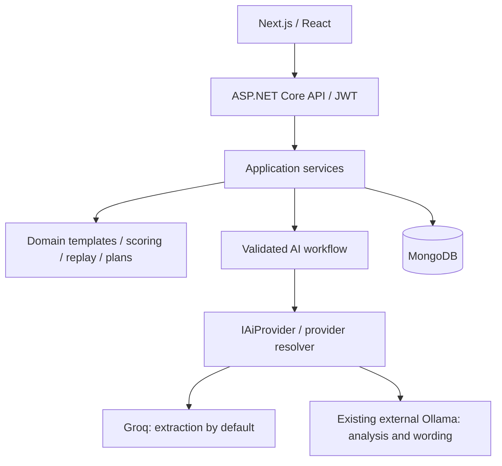
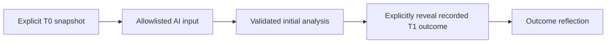

# Decision Replay

Decision Replay preserves the information available when a decision was made, then lets you examine changed assumptions and compare the eventual outcome separately. Decision quality and outcome quality are different: a reasonable process can have an unfortunate outcome.

The existing domain engine still owns feasibility scores, risk classification, recommendations, action-plan structure and exports. AI extracts fields and supplies validated advisory analysis; it cannot change those deterministic results. This is a decision workflow, rather than a general chatbot.

## Architecture



The backend has Domain, Application, Infrastructure and API projects. Provider-specific HTTP code lives in Infrastructure. Controllers delegate to application services. Next.js uses the existing App Router, authentication and UI components. See [repository audit](docs/repository-audit.md) and [implementation report](docs/implementation-report.md).

## Configuration and local development

Copy `backend/.env.example` to `backend/.env` and `frontend/.env.example` to `frontend/.env.local`. Supply MongoDB and a random JWT secret of at least 32 characters. Keep these files private. Runtime environment variables take precedence over dotenv values.

Default `AI_PROVIDER=hybrid` keeps **Groq extraction**, using `GROQ_API_KEY` and `GROQ_MODEL`, and uses Ollama for other operations. `AI_PROVIDER=ollama` enables all-local extraction and analysis without a cloud key; `AI_PROVIDER=groq` selects cloud inference throughout. `AI_EXTRACTION_PROVIDER` optionally overrides extraction routing. `AI_MODEL` overrides the model only in a single-provider mode. Provider secrets never reach the frontend.

Use the **existing** `sovereign-dev` Ollama container and its installed model. This project does not install Ollama, pull model weights, or manage that container or volume. Ensure it is running through its owning project's normal workflow.

```env
# Backend running directly on Windows
OLLAMA_BASE_URL=http://localhost:11434
OLLAMA_MODEL=qwen2.5-coder:3b
# Backend inside Docker Desktop: use this URL instead
# OLLAMA_BASE_URL=http://host.docker.internal:11434
AI_REQUEST_TIMEOUT_SECONDS=120
AI_MAX_RETRIES=1
AI_TEMPERATURE=0.1
AI_MAX_OUTPUT_TOKENS=2048
```

The backend checks `GET /api/tags` for the exact configured model before Ollama inference, then sends `POST /api/chat` with `stream=false` and reads `message.content`. No Ollama API key is required. URLs and model names come from configuration. A missing model fails explicitly; there is deliberately no automatic download mechanism.

Direct development, in separate PowerShell terminals:

```powershell
cd backend/DecisionReplay.API
dotnet run
```

```powershell
cd frontend
npm ci
npm run dev
```

Use MongoDB at the configured connection string. The frontend defaults to `http://localhost:5000/api`; keep `/api` in `NEXT_PUBLIC_API_URL`. `NEXT_PUBLIC_API_TIMEOUT_MS` controls the browser request deadline (default 900000 ms, accommodating sequential evaluations).

From the repository root, copy `.env.example` to `.env` if you need Compose overrides, then:

```powershell
docker compose up --build
```

Compose manages only this project's frontend, backend and MongoDB, with a separate Mongo volume. Its backend reaches the existing Ollama through Docker Desktop's host gateway. Frontend port defaults to **3001** to avoid the existing sovereign-dev frontend; backend uses 5000 and Mongo uses 27017. Adjust conflicting host ports before starting. Application images contain dependencies and compiled code, never model weights. Do not run lifecycle commands against the sovereign-dev project from here.

CPU inference is supported. In the observed environment, the loaded Q4 model occupied approximately 2.3 GiB in Ollama and used no VRAM; several analyses exceeded 120 seconds. Allow memory for the OS, Mongo and both applications as well. An 8 GiB machine can be tight; 16 GiB provides more headroom. These are planning estimates, not guaranteed minimum requirements. Increase the configurable timeout for a slow CPU if appropriate; keep inference sequential because resources are shared.

## Historical replay and hindsight protection

The original feasibility `Outcome` enum remains unchanged; it is not an actual business outcome. Actual outcomes are separate append-only records.

A version can hold a T0 snapshot: decision timestamp, decision text, chosen action, expected outcome, domain fields, evidence, assumptions, constraints and alternatives. Statements have identifiers and `KnownAt` timestamps validated against T0. Legacy decisions receive a snapshot labelled as recorded-time context, not proof that its contents were known historically. Editing historical context appends a new version and recomputes deterministic results; old versions remain available. Regenerating a plan also creates a version.



Initial analysis serializes only the T0 projection, never the complete decision entity, actual outcomes or existing AI results. Outcome reflection is a separate endpoint and requires a completed T0 analysis for the outcome's version. Hypothetical scenarios cannot be compared to an original real-world outcome as though it belonged to them.

What-if scenarios copy a named version, record explicit field/assumption/constraint changes, recompute deterministic assessment, and append AI analyses without replacing the original. Narrative assumption changes affect advisory analysis; numerical scores change only when scored domain fields change. Optimistic revisions protect concurrent writes.

Timestamps are user-attested. The design prevents application-provided outcome leakage; it cannot erase a pretrained model's historical knowledge or prove that a user did not enter later information into T0. Advisory citations validate identifier integrity, not factual entailment.

## AI contracts, prompts and failure handling

`IAiProvider` defines generic transport, availability and generation operations. `AiWorkflowService` resolves a versioned prompt, builds a bounded request, records execution metadata, parses strict JSON and validates typed output before business use. `IAiLanguageService` remains the compatibility adapter for existing extraction, explanation and plan workflows.

Prompts are embedded, version-controlled JSON manifests in `backend/DecisionReplay.Infrastructure/AI/Prompts`. Each execution records the operation, version and SHA-256 prompt/input hashes. Analysis v1/v2 remain available for experiments; historical analysis defaults to v3. V3 uses a compact JSON Schema with evidence IDs derived from the supplied T0 context. Ollama enforces this schema during generation; Groq uses JSON-object output with the same server-side validation, and executions explicitly record this capability difference. Retry repair has its own versioned prompt and hash.

Required properties, unknown members, empty responses, lengths, finite confidence, missing collections, duplicate/unknown evidence IDs and unsupported non-hypothesis claims are checked. Model confidence is self-reported, not calibrated probability. A valid structure does not establish reasoning quality.

Bounded retries handle malformed output, validation failure, connection errors, timeouts, rate limits and transient HTTP failures. Backoff respects a bounded `Retry-After`; permanent configuration and missing-model errors fail without inference retries. Caller cancellation is distinct from provider timeout. Optional fallback requires both `AI_FALLBACK_PROVIDER` and `AI_FALLBACK_MODEL`; it is disabled for benchmarks. Enabling cloud fallback explicitly allows decision context to leave the local runtime.

`AI_FAILURE_MODE=deterministic` preserves existing extraction/wording fallback behavior while recording failed AI executions. Historical analysis and evaluation always expose failures. `AI_FAILURE_MODE=error` also makes legacy operations return explicit AI errors. Startup validates selected-provider configuration and credentials. Detailed health distinguishes reachable local inference from cloud credentials merely being configured.

## Evaluation, experiments and benchmarking

The embedded golden dataset `AI/Datasets/decisions.v1.json` contains three manually prepared synthetic startup, career and software-delivery cases. Expected concepts use keyword groups and synonyms, not exact wording. Dataset and prompt hashes, provider/model, parameters, timestamps, case outputs, execution IDs and actual metrics are persisted per experiment.

Metrics measure structured validity, keyword-based missing-information/risk/alternative coverage, citation integrity, uncited non-hypothesis claims, latency and failure rate. Coverage is a deliberately limited proxy. Citation integrity only checks legal reference IDs; an empty set is vacuously valid. Failed cases contribute zero coverage and validity, so aggregate quality proxies include operational failures. Human review is separate and initially null. There is no uncalibrated LLM judge and no fabricated human scores.

The AI Lab runs cases/models sequentially, displays per-case output and compares experiments only when dataset, prompt, parameters, timeout/retry budgets and output-contract version match. Benchmark provider fallback is disabled to keep model identity honest. Token counts are reported only when supplied by the provider. API cost is unknown/null until a real accounting mechanism exists; local inference has infrastructure and hardware costs even without an API charge. System resource usage is not currently sampled automatically.

Run evaluation through the same backend runtime without Mongo or cloud credentials:

```powershell
cd backend/DecisionReplay.API
dotnet run -- --evaluate --evaluation-provider=ollama --evaluation-model=qwen2.5-coder:3b --prompt-version=v3 --evaluation-output=../../artifacts/evaluations/my-run.json
```

For cloud comparison, use the same command with `--evaluation-provider=groq` and the configured model, supplying server-side credentials. Do not run concurrent local evaluations. CLI artifacts are file-backed; authenticated API experiments are Mongo-backed. A run with failed cases exits nonzero while preserving its results.

Real local runs are checked in under `artifacts/evaluations`. V1 and v2 validated 0/3 cases. V3 validated 1/3, with two final timeouts at a 120-second per-attempt deadline and one retry. The validated case missed expected risk concepts. These small diagnostic runs are not a statistical model ranking. See the implementation report for measured timings and limitations.

## Observability and persistence

AI execution records contain request/decision/scenario/experiment identifiers, context version, provider/model (Ollama digest where returned), prompt/repair/schema hashes, parameters, timing, attempts, tokens, validation errors, bounded raw output and final status. `DecisionReplay.AI` exposes .NET activities and metrics for inference and validation plus structured logs that omit keys and prompt contents. An external telemetry exporter is not configured.

Mongo adds `ai_executions` and `ai_experiments`; existing decisions gain optional snapshots, analyses, actual outcomes, scenarios and an optimistic revision. Old documents remain readable. Prompts/datasets use source control rather than mutable database records. Owner checks protect decisions, executions and experiments. Raw outputs can contain decision information: apply an appropriate retention/access policy before production use.

## APIs and UI

Existing v2 decision creation, retrieval, text replay, plans and exports remain. New authenticated routes:

| Route | Purpose |
| --- | --- |
| `GET /api/v2/decisions/{id}/timeline` | Historical versions, scenarios and outcomes |
| `POST .../{id}/context` | Append a T0 context version |
| `POST .../{id}/outcomes` | Record actual T1 outcome |
| `POST .../{id}/scenarios` | Create immutable what-if context |
| `POST .../{id}/ai-analysis` | Append T0/scenario analysis |
| `POST .../{id}/outcome-reflection` | Explicit T1 comparison stage |
| `GET /api/ai/configuration` | Safe provider/prompt settings |
| `GET /api/ai/executions` and `/{id}` | Owned execution metadata and details |
| `POST/GET /api/ai/experiments` and `GET /{id}` | Run/retrieve experiments |
| `GET /api/ai/experiments/comparison?ids=...&ids=...` | Comparable model results |

The existing report links to Historical Replay. AI Lab exposes real experiments and execution diagnostics without replacing the existing frontend.

## Testing and limitations

```powershell
cd backend
dotnet test DecisionReplay.sln
cd ../frontend
npm ci
npm run lint
npm run typecheck
npm run build
```

Transport integration tests use mock HTTP handlers and need no cloud key. Tests cover routing, prompt resolution, strict parsing, retries/fallback/cancellation, Ollama/Groq protocol contracts, T0 isolation, explicit outcome reveal, version immutability, optimistic concurrency and evaluation persistence. Live connectivity can be checked from the actual backend environment with `dotnet run -- --check-ollama`, or from its built Docker image using the configured Docker Desktop URL.

This remains a development/portfolio system: three cases are insufficient for general quality claims; semantic groundedness and consistency need human evaluation; full-stack browser/Mongo integration coverage needs expansion. Embedded histories are capped but large documents still need a production archival strategy. Existing JWT browser storage and deployment hardening should be reviewed before handling sensitive decisions. RAG, agent frameworks and LLM-as-a-judge are intentionally absent because the current structured workflow does not require them.

Next improvements should prioritize human-reviewed cases, reliable CPU-sized inference budgets, real provider comparisons with matched settings, Mongo migration/integration tests, archival/retention and deployment telemetry. Do not relax validation just to improve apparent success rates.
